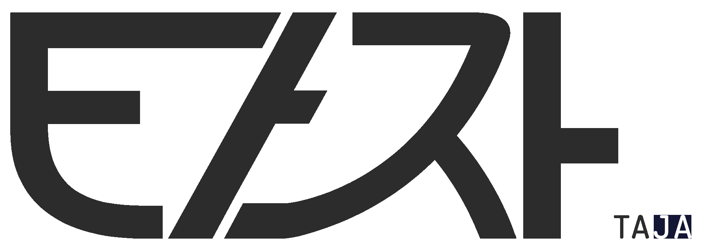

<div align="center">
  <a href="https://lluckymou.github.io/ezra-taja/">
    
  </a>
  <br><br>

  _Learning Korean by typing_ | _타이핑으로 한국어 배우기_

  <a href="https://github.com/sponsors/lluckymou?frequency=one-time">
    
  </a>
</div>

---

**EZRA Taja** is a roguelite dungeon crawler where you defeat monsters by typing Korean words. It was born out of a frustration: my Korean teacher showed me [Hancom Taja](https://taja.hancom.com), a classic Korean typing trainer, but I couldn't use it because my system locale wasn't set to Korean. So I built my own version - and then kept going.

The philosophy here isn't to _gamify_ learning. It's the opposite: to *"learnify"* a game - take something genuinely fun and challenging, and weave language learning into its game design so naturally that vocabulary acquisition becomes a side effect of playing. The goal is a game worth playing on its own merits, where Korean just happens to be the mechanic.

The first version took roughly a month to build and ships with a full roguelite feature set alongside a serious vocabulary system.

---

## Features

- **800+ Korean words** across 20+ thematic categories (places, food, animals, body, emotions, verbs, adjectives, culture, hanja...)
- **Emoji disambiguation system** - every word has a primary emoji and optional secondary for homonyms (눈 👁️ vs 눈 ❄️)
- **Vocabulary progression** - words unlock gradually as you improve; kill counts hide mastered words from the enemy pool
- **15 dungeon worlds** inspired by real Korean locations, each with its own biome, enemy pool, and visual theme
- **Boss encounters** with multiple special types: archer, ice, musician, warrior, eruptor, king
- **Item system** - consumables, permanent upgrades, modifier rooms, treasure rooms
- **Casino room** with slot mechanics
- **Teacher NPC** - in-run lesson room with a cooldown system; lessons unlock new vocabulary
- **Vocabulary exam system** - level up your word knowledge through structured tests
- **Character creation** - full Avataaars-based character editor with unlockable weapon skins
- **My Dictionary** - persistent cross-run vocabulary book tracking every word you've encountered
- **Day/night cycle** (420s full cycle: dawn, day, dusk, night) with visual lighting changes
- **Dynamic weather events** - fog, rain, snow, blizzard, blossoms, autumn leaves; affects readability and immersion
- **Text-to-speech** - Korean pronunciation for every word you type
- **Varying fonts** - randomized Korean typefaces per monster to train reading across styles
- **Minimap** with full dungeon layout, room type indicators, and fog of war
- **Multiple languages** - UI in English, Portuguese, and Korean
- **Touch support** - full on-screen Hangul keyboard with composition for mobile play
- **Responsive layout** - works on desktop, tablet, and mobile without needing Korean locale
- **Hanja powerup system** - optional Chinese character pickups for advanced learners

---

## Playing Locally

No build step required - this is plain ES6 modules. You just need a local HTTP server (browsers block module imports from `file://`).

1. Serve the directory with a local web server:
   ```bash
   python3 -m http.server 8000
   ```
2. Open http://localhost:8000 in your browser

---

## Game Controls

### Desktop
- **Type** Korean words using QWERTY keyboard (built-in Hangul typing system)
- **Ctrl** - Open inventory and quick-action panel
- **Left/Right Arrows** - select item
- **Down Arrow** - use selected item
- **M** - toggle minimap
- **B** - open dictionary
- **북/남/동/서** (north/south/east/west) - navigate between rooms

### Mobile
- Touch input with on-screen Hangul composition keyboard
- Tap door buttons to navigate
- All controls accessible via touch UI

---

## Browser Compatibility

- Chrome/Edge 90+
- Firefox 88+
- Safari 14+
- Mobile browsers (iOS Safari, Chrome Mobile)

---

## Credits

**Lucas Nascimento** - Design, Architecture & Implementation

*Inspired by **[Hancom Taja](https://taja.hancom.com)** and **[The Binding of Isaac](https://en.wikipedia.org/wiki/The_Binding_of_Isaac_(video_game))**.*

> 🇰🇷🫰 A special thanks for Roh HaYoung and [KIT](https://kitsign.co.kr/) for showing me Korean culture and language, I'm eternally grateful to all of you. You have changed my life forever. I hope this project inspires more people to study your language and connect to your beautiful and inspiring culture.

---

## License

This software is licensed under the **Business Source License 1.1**. See [LICENSE](LICENSE) for full terms.

**Non-commercial use only.** Any use for commercial purposes is prohibited until the Change Date for the respective version (commit date + 5 years). After that, the code is released under GNU GPL v3.
